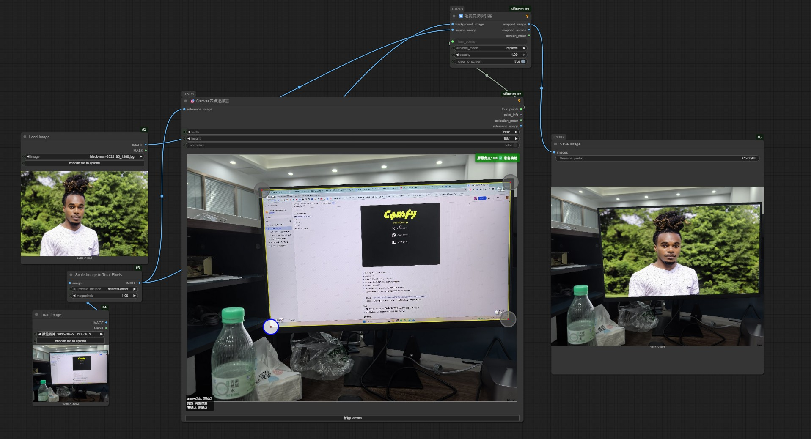
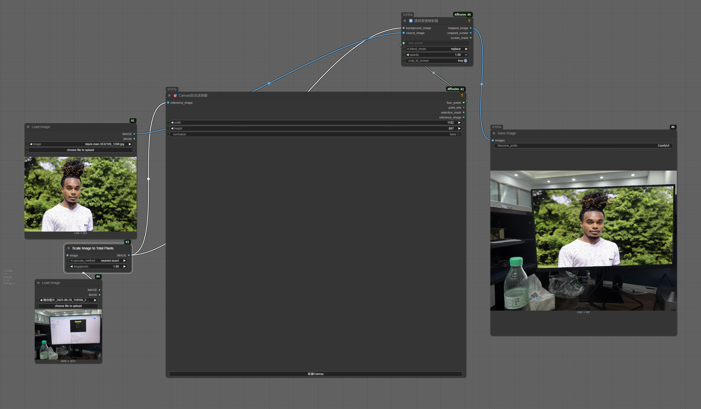
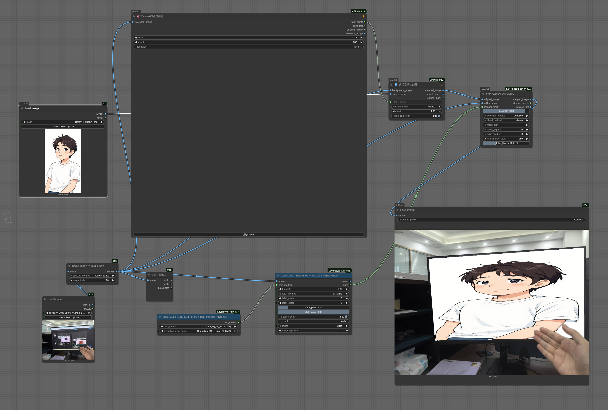

# ComfyUI Affine Transform Mapper / ComfyUI 仿射变换映射器

> Interactive 4-point affine transformation for seamless image composition
> 
> 基于交互式四点选择的仿射变换图像合成工具

---


## English

Precisely transform and insert any image into a defined 4-point area within another image using interactive canvas-based point selection.

What's it can do: Insert image to specific location of another image.

### Core Functionality
- **4-Point Affine Transformation**: Map any source image to fit exactly within 4 selected corner points
- **Interactive Point Selection**: Visual canvas interface for precise point positioning
- **Seamless Image Composition**: Advanced blending modes for natural integration
- **Real-time Preview**: Instant visual feedback during point selection

### How it works
The tool performs precise perspective transformation to fit your source image within any quadrilateral area you define by selecting 4 corner points on the target image.

1. **Canvas Four Point Selector**: Interactively select 4 corner points on your target area
2. **Perspective Transform Mapper**: Apply mathematical transformation to fit source content within selected bounds

### Key Applications
- **Photo Composition**: Insert artwork, designs, or content into frames, windows, or surfaces
- **Mockup Creation**: Place designs onto books, posters, billboards, or any flat surface
- **Content Integration**: Seamlessly blend generated content into photographs
- **Perspective Correction**: Transform images to match specific viewing angles

### Installation
```bash
cd ComfyUI/custom_nodes/
git clone https://github.com/GuardSkill/ComfyUI-AffineImage.git
cd ComfyUI-Affine-Transform
pip install -r requirements.txt
```

### Usage
- **Shift + Click**: Add corner points (exactly 4 needed)
- **Drag**: Adjust point positions for perfect alignment
- **Right-click**: Delete points or access context menu
- **Workflow**: Point Selector → four_points → Transform Mapper


### workflow example(just drag it to comfy)

Basic Version


Advanced Version to restore some foreground.

---

## 中文

通过交互式Canvas四点选择，精确地将任意图像仿射变换并插入到另一张图像的指定四点区域内。
可实现的功能： 手动指定四个点，把一张图像插入到另一张图像的屏幕/书籍/物体表面上，而且看起来合理。

### 核心功能
- **四点仿射变换**: 将源图像精确映射到选定的四个角点范围内
- **交互式点选择**: 可视化Canvas界面，精确定位四个角点
- **无缝图像合成**: 高级混合模式实现自然融合
- **实时预览**: 选点过程中即时视觉反馈

### 工作原理
该工具通过透视变换数学计算，将源图像精确适配到你在目标图像上选择的任意四边形区域内。

1. **Canvas四点选择器**: 在目标区域交互式选择4个角点
2. **透视变换映射器**: 应用数学变换将源内容适配到选定范围

### 主要应用
- **照片合成**: 将艺术作品、设计或内容插入画框、窗户或表面
- **样机制作**: 将设计放置到书籍、海报、广告牌或任何平面上
- **内容集成**: 将生成内容无缝融合到摄影作品中
- **透视校正**: 变换图像以匹配特定视角

### 安装方法
```bash
cd ComfyUI/custom_nodes/
git clone https://github.com/GuardSkill/ComfyUI-AffineImage.git
cd ComfyUI-Affine-Transform
pip install -r requirements.txt
```

### 使用方法
- **Shift + 点击**: 添加角点（需要精确4个）
- **拖拽**: 调整点位置以完美对齐
- **右键**: 删除点或访问上下文菜单
- **工作流**: 点选择器 → four_points → 变换映射器
基础班

高级版（可以自定义保留一些前景）


### 节点详解

#### Canvas四点选择器
- **核心功能**: 在目标图像上精确选择变换区域的四个角点
- **输出**: 四个点的坐标数据，供变换计算使用

#### 透视变换映射器
- **核心功能**: 执行数学仿射变换，将源图像适配到四点区域
- **特性**: 支持多种混合模式、透明度控制、自动裁剪

### 技术优势
- **数学精确性**: 基于OpenCV的高精度透视变换算法
- **视觉直观**: 交互式界面无需手动输入坐标
- **灵活适用**: 适配任意形状的四边形区域
- **质量保证**: 支持高分辨率图像处理

### 使用场景
- 将UI设计放置到设备屏幕上（屏幕映射只是应用之一）
- 在照片中的画框内插入艺术作品
- 将设计稿放置到产品包装或宣传材料上
- 在建筑照片的窗户或表面上添加内容
- 制作各类产品样机和展示效果

---

## Technical Requirements / 技术要求

- ComfyUI environment / ComfyUI环境
- OpenCV, NumPy, PIL/Pillow
- Modern browser for canvas interaction / 现代浏览器支持Canvas交互

## License / 许可证

MIT License